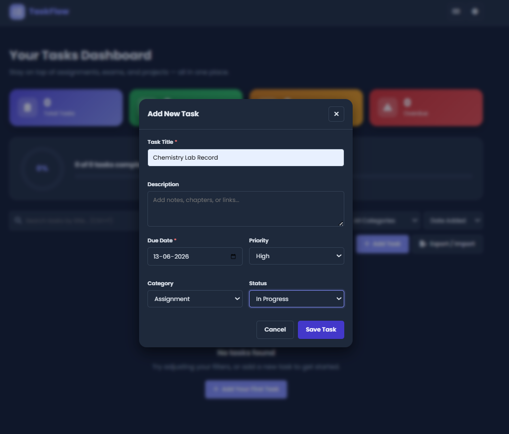

# 🚀 TaskFlow — Student Task Manager
🌐 Live Demo: https://likhithamadisetti1-max.github.io/Student-Task-Manager/
A modern, production-quality task management dashboard built with **vanilla
HTML, CSS, and JavaScript (ES6 classes & modules)** — no frameworks, no build
step. Designed to be **portfolio and internship-ready**: a polished UI
inspired by Notion, Trello, Todoist, and Asana, with a fully modular codebase
that's easy to read, extend, and explain in an interview.


---

## 📑 Table of Contents

1. [Features](#-features)
2. [Tech Stack](#-tech-stack)
3. [Folder Structure](#-folder-structure)
4. [Architecture — How It All Fits Together](#-architecture--how-it-all-fits-together)
5. [Getting Started](#-getting-started)
6. [Usage Guide](#-usage-guide)
7. [Keyboard Shortcuts](#-keyboard-shortcuts)
8. [Data & Local Storage](#-data--local-storage)
9. [Accessibility](#-accessibility)
10. [Browser Support & Known Limitations](#-browser-support--known-limitations)
11. [Pushing to GitHub](#-pushing-to-github)
12. [Screenshots](#-screenshots)
13. [Future Enhancements](#-future-enhancements)
14. [License](#-license)

---

## ✨ Features

### Dashboard
- 📊 **Stats cards** for Total, Completed, Pending, and Overdue tasks — each
  with a Font Awesome icon, gradient background, and hover-lift animation
- 🟣 **Animated circular progress ring** + linear progress bar showing
  "X of Y tasks completed (Z%)"

### Task Management (Full CRUD)
- ➕ **Add**, ✏️ **edit**, 🗑️ **delete**, and ✅ **mark complete** tasks
- Each task has: **title, description, due date, priority (High/Medium/Low),
  category (Assignment, Exam Prep, Project, Personal), and status (Not
  Started, In Progress, Completed)**
- **Form validation**: title and due date are required, and due dates can't
  be set in the past (existing overdue tasks can still be edited)
- Task cards show: priority badge, category badge, due date, a **live
  countdown** ("Due in 2 days", "Overdue by 1 day"), a status-based progress
  bar, and an **"Overdue" badge with a red border** for late tasks

### Search, Filter & Sort
- 🔍 Live **search by title**
- 🎛️ **Filter** by status, priority, and category (combinable)
- ↕️ **Sort** by Date Added (manual order), Due Date, Priority, or
  Alphabetically

### Productivity
- 🔔 **Toast notifications** when a task is due within 24 hours or becomes
  overdue (checked on load and every 5 minutes, each task notifies only once)
- 🌗 **Dark mode** with smooth theme-transition animation, remembered between
  visits
- 🖱️ **Drag-and-drop reordering** of task cards — the new order is saved
  automatically

### Data Portability
- 📄 **Export to PDF** (via jsPDF) — a clean, printable task report
- 📑 **Export to CSV** — open in Excel/Google Sheets
- 📥 **Import from JSON** — bulk-add tasks from a file

### Polish & Accessibility
- 🎬 CSS-only animations: fade-in cards, hover effects, button "press"
  feedback, modal pop-ins, toast slides, drag transitions
- 🖼️ Custom **empty-state illustration** and a **loading spinner**
- ♿ Semantic HTML, ARIA labels, keyboard navigation, focus outlines, a skip
  link, and `prefers-reduced-motion` support
- 📱 **Fully responsive** — desktop, tablet, and mobile layouts

---

## 🛠 Tech Stack

| Layer | Technology |
|---|---|
| Structure | Semantic HTML5 |
| Styling | CSS3 (custom properties / design tokens, Grid, Flexbox, keyframe animations) |
| Behavior | Vanilla JavaScript (ES6 classes + ES Modules) |
| Font | [Poppins](https://fonts.google.com/specimen/Poppins) (Google Fonts) |
| Icons | [Font Awesome 6](https://fontawesome.com/) (CDN) |
| PDF export | [jsPDF](https://github.com/parallax/jsPDF) (CDN) |
| Persistence | Browser `localStorage` |

> No npm, no bundler, no backend — everything runs directly in the browser.
> An internet connection is needed the first time the page loads, to fetch
> the font, icons, and jsPDF from their CDNs.

---

## 📁 Folder Structure

```
student-task-manager/
│
├── index.html              → Page structure: dashboard, modals, toasts
│
├── css/
│   ├── style.css           → Design tokens, layout, components (the "skeleton")
│   ├── animations.css       → All keyframes + animation classes
│   └── darkmode.css         → Dark theme variable overrides
│
├── js/
│   ├── storage.js           → Wraps localStorage (tasks, theme, filters, sort)
│   ├── taskManager.js        → Task + TaskManager classes (CRUD, sort, filter, stats)
│   ├── ui.js                 → UIManager — renders stats, progress, task cards, modals
│   ├── notifications.js      → NotificationManager — toasts + deadline alerts
│   ├── dragdrop.js            → DragDropManager — HTML5 drag-and-drop reordering
│   └── app.js                 → App — wires everything together (the "controller")
│
├── assets/
│   ├── icons/                → Reserved for custom icons (currently uses Font Awesome via CDN)
│   └── images/                → Reserved for screenshots / illustrations
│
└── README.md
```

---

## 🧠 Architecture — How It All Fits Together

Every feature follows the same loop:

```
User action (click / type / drag)
        │
        ▼
   app.js (App class)
        │
        ├─► taskManager.js  → updates the tasks array + saves to localStorage
        │
        └─► ui.js           → re-renders stats, progress ring, and task cards
```

### `js/storage.js` — `StorageManager`
The **only** file that touches `localStorage`. Static methods:
`getTasks/saveTasks`, `getTheme/saveTheme`, `getFilters/saveFilters`,
`getSort/saveSort`, and `getNotifiedIds/saveNotifiedIds` (used to avoid
repeating deadline toasts).

### `js/taskManager.js` — `Task` & `TaskManager`
- `Task` is a small class representing one task (id, title, description,
  dueDate, priority, category, status, createdAt).
- `TaskManager` holds the in-memory `tasks` array and provides:
  - **CRUD**: `addTask`, `updateTask`, `deleteTask`, `getTaskById`,
    `markComplete`
  - **Reordering**: `reorder(orderedIds)` (used by drag-and-drop)
  - **Filtering**: `filter({ search, status, priority, category })`
  - **Sorting**: `sort(tasks, sortBy)` — `"dateAdded"` preserves the
    array's current order (which is what makes drag-and-drop "stick"); the
    others sort by due date, priority, or title
  - **Stats**: `getStats()` → `{ total, completed, pending, overdue }` and
    `getProgress()` → `{ completed, total, percent }`
  - **Deadlines**: `getDeadlineInfo(dueDate)` → a label + CSS class like
    `{ label: "Due tomorrow", className: "due-soon" }`

### `js/ui.js` — `UIManager`
Turns data into DOM elements. Renders the stats cards, the progress
ring/bar, and every task card (including badges, countdown, and per-task
progress bar). Also provides `openModal` / `closeModal`, form-filling
(`fillTaskForm`), validation message helpers, and a small `pressEffect()`
used for the button-click animation. **UIManager never changes task data.**

### `js/notifications.js` — `NotificationManager`
- `showToast(message, type, duration)` — renders a toast in the bottom-right
  corner (success / warning / danger / info), auto-dismissing with a slide
  animation.
- `checkDeadlines(taskManager)` — scans all incomplete tasks; if one is
  overdue or due within 24 hours, shows a toast **once** (remembered via
  `StorageManager.getNotifiedIds`).

### `js/dragdrop.js` — `DragDropManager`
Implements the native HTML5 Drag and Drop API on the task grid: tracks the
dragged card, live-previews its new position as you drag over other cards,
and on drop reports the new order of task ids back to `app.js` via a
callback — which calls `taskManager.reorder(...)`.

### `js/app.js` — `App`
The controller. On startup it:
1. Applies the saved theme and restores saved filters/sort
2. Shows a brief loading state, then renders the dashboard
3. Binds every event listener (form submit, modal open/close, search,
   filters, sort, drag-and-drop, export/import, keyboard shortcuts)
4. Runs the first deadline check, then re-checks every 5 minutes

---

## 🚀 Getting Started

You need two free tools. If you already have them, skip to step 3.

### 1. Install Visual Studio Code
Download from [code.visualstudio.com](https://code.visualstudio.com) and
install with default options.

### 2. Install the "Live Server" extension
Open VS Code → **Extensions** (sidebar icon) → search **"Live Server"** by
Ritwick Dey → **Install**.

> 💡 **Why do I need a server?** `app.js` uses ES module `import`/`export`
> syntax. Browsers block modules from loading over `file://` (double-clicking
> the HTML file) for security reasons. Live Server serves the page over
> `http://localhost`, which fixes this instantly.

### 3. Open the project
- **File → Open Folder...** → select the `student-task-manager` folder.
- You should see `index.html`, `css/`, `js/`, `assets/`, and `README.md` in
  the Explorer panel.

### 4. Run it
- Right-click `index.html` → **"Open with Live Server"**.
- Your browser opens automatically at `http://127.0.0.1:5500`. Any time you
  save a file, the page refreshes automatically.

(Alternative: run `python -m http.server 5500` in the project folder and
open `http://localhost:5500`.)

---

## 📖 Usage Guide

### Adding a task
Click **"+ Add Task"** (or press `Ctrl+N`). Fill in the title and due date
(required), and optionally a description, priority, category, and status.
Click **Save Task**.

### Editing / deleting / completing
Each task card has three buttons in the footer:
- ✅ **Mark complete** (hidden once a task is completed)
- ✏️ **Edit** — opens the same form, pre-filled
- 🗑️ **Delete** — opens a confirmation modal before removing the task

You can also change a task's status directly from the dropdown on its card.

### Searching, filtering, and sorting
Use the search box to filter by title as you type. Use the **Status**,
**Priority**, and **Category** dropdowns to narrow the list further (they
combine — e.g. "High priority Exam Prep tasks that are In Progress"). Use the
**Sort by** dropdown to reorder the visible list.

### Reordering tasks
Click and drag any task card by its top area to a new position. The new
order is saved automatically and is visible when **Sort by → Date Added**
(the default / manual order).

### Dark mode
Click the moon/sun icon in the top-right corner. Your preference is
remembered the next time you open the app.

### Exporting & importing
Click **"Export / Import"** in the toolbar:
- **Export as PDF** — downloads a formatted report of all tasks
- **Export as CSV** — downloads a spreadsheet-friendly file
- **Import from JSON** — choose a `.json` file containing an array of task
  objects (or `{ "tasks": [...] }`). Each item needs at least a `title` and
  `dueDate`; missing fields fall back to sensible defaults.

Example JSON for import:

```json
[
  {
    "title": "Read Chapter 4",
    "description": "Focus on the summary questions",
    "dueDate": "2026-06-20",
    "priority": "medium",
    "category": "assignment",
    "status": "not-started"
  }
]
```

---

## ⌨️ Keyboard Shortcuts

| Shortcut | Action |
|---|---|
| `Ctrl` / `Cmd` + `N` | Open the "Add Task" form |
| `Ctrl` / `Cmd` + `F` | Focus the search box |
| `Esc` | Close any open dialog |

(Click the keyboard icon in the navbar to see this list in-app.)

---

## 💾 Data & Local Storage

Everything is stored in your browser under these keys:

| Key | Stores |
|---|---|
| `taskflow_tasks` | The full task list, in its current (drag-and-drop) order |
| `taskflow_theme` | `"light"` or `"dark"` |
| `taskflow_filters` | Current search text + status/priority/category filters |
| `taskflow_sort` | Current sort selection |
| `taskflow_notified_ids` | Task ids that have already triggered a deadline toast |

Data persists across page refreshes and browser restarts, but is local to
**this browser on this device** — it is not synced anywhere. Clearing your
browser's site data will reset the app.

---

## ♿ Accessibility

- Semantic landmarks (`<header>`, `<main>`, `<section>`, `<article>`) and a
  **skip-to-content** link
- All interactive controls have `aria-label`s; modals use
  `role="dialog"` + `aria-modal="true"`
- Full keyboard support: tab through controls, `Esc` closes modals, visible
  focus outlines everywhere
- Color choices meet WCAG AA contrast in both light and dark themes
- Respects `prefers-reduced-motion` by disabling animations for users who
  have requested it

---

## 🌐 Browser Support & Known Limitations

- Works in all modern browsers (Chrome, Edge, Firefox, Safari).
- Requires an internet connection on first load for Google Fonts, Font
  Awesome, and jsPDF (all loaded via CDN). If you need a fully offline
  version, download these libraries and reference them locally.
- Drag-and-drop reordering uses the HTML5 Drag and Drop API, which has
  limited support on touch-only devices — reordering on mobile can be added
  later via a touch-friendly library (see Future Enhancements).
- Data is stored per-browser via `localStorage`, so it won't appear if you
  switch browsers or devices.

---

## 🔧 Pushing to GitHub

```bash
# From inside the student-task-manager folder:
git init
git add .
git commit -m "TaskFlow: production-ready student task manager"
git branch -M main
git remote add origin https://github.com/YOUR-USERNAME/student-task-manager.git
git push -u origin main
```

For future updates:

```bash
git add .
git commit -m "Describe your changes"
git push
```

---

## 📸 Screenshots

> Add screenshots of your running app here for your portfolio/resume. Save
> images into `assets/images/` and reference them like this:

```markdown



```

Good shots to capture: the full dashboard in light and dark mode, the Add
Task modal, a filtered/searched view, and the empty state.

---

## 🚀 Future Enhancements

- 🔐 **Accounts + backend** — sync tasks across devices with a real API and
  database (Node.js/Express + MongoDB or PostgreSQL)
- 📱 **Touch-friendly drag-and-drop** for mobile (e.g. via a pointer-events
  based reordering library)
- 🔔 **Native browser notifications** (Notifications API) for deadlines, in
  addition to in-app toasts
- 🏷️ **Custom categories/tags** defined by the user
- 📅 **Calendar view** alongside the card grid
- 🔁 **Recurring tasks** (daily/weekly/monthly)
- 📊 **Analytics view** — completion trends over time, charts per category
- 🧪 **Unit tests** for `TaskManager` (e.g. with Vitest)
- 🌍 **Internationalization (i18n)** for multiple languages
- 🖼️ **Custom local icon set** in `assets/icons/` to remove the Font Awesome
  CDN dependency for offline use

---

## 📄 License

This project is open-source and free to use for learning, portfolios, and
personal projects.
